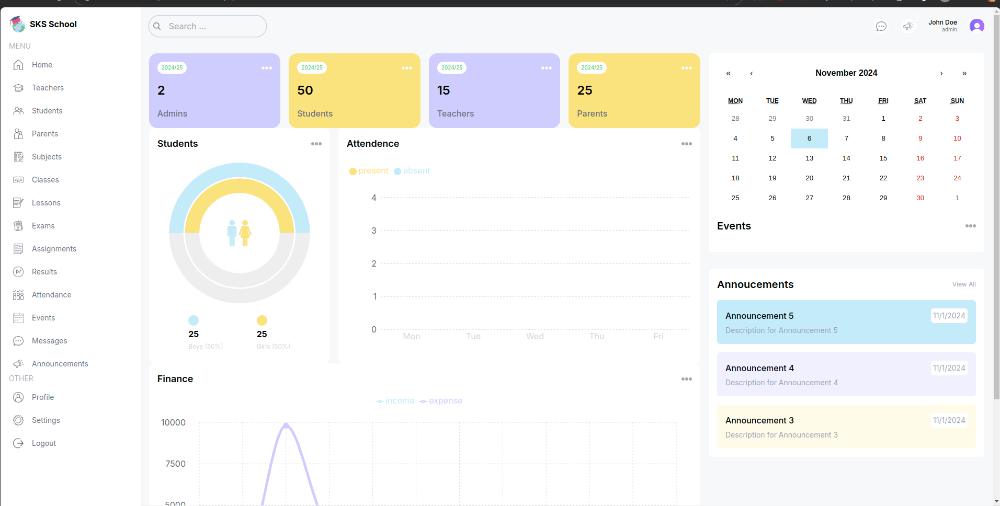
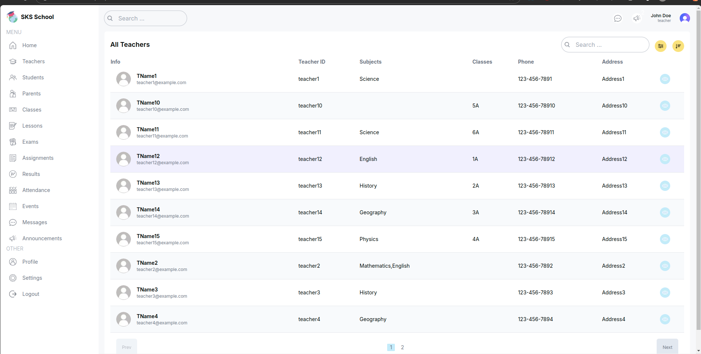
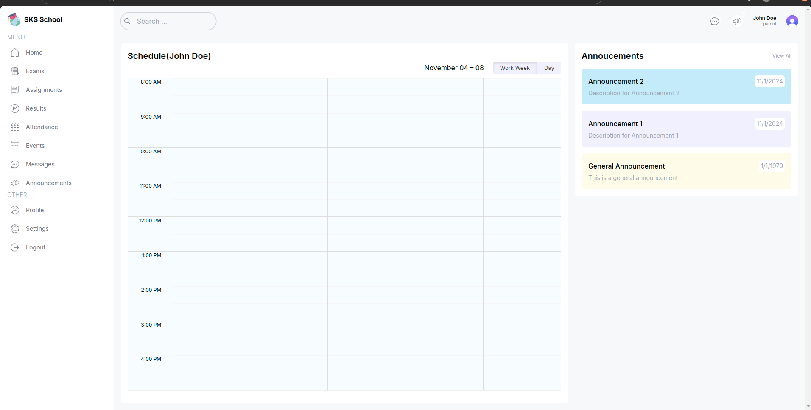
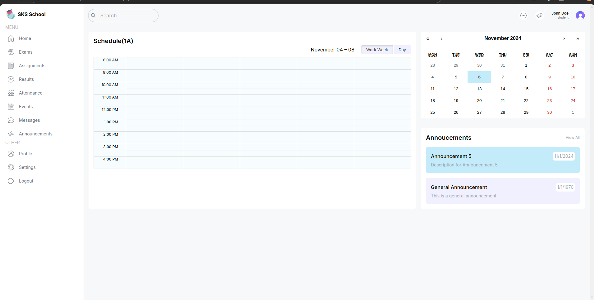

# School Management Dashboard System

The School Management Dashboard System is a comprehensive solution for managing various aspects of school administration, student information, teacher management, and more. This system provides different views and functionalities for admins, students, teachers, and parents, enhancing communication and efficient organization within the school environment.

## Table of Contents

- [Features](#features)
- [Screenshots](#screenshots)
- [Technologies Used](#technologies-used)
- [Installation](#installation)
- [Usage](#usage)

## Features

1. **Admin Dashboard**: Access to manage students, teachers, parents, and view financial summaries.
2. **Teacher Dashboard**: Ability to view and create exams, manage class schedules, and view announcements. Teachers have similar access to admins but cannot create new teachers or students.
3. **Student Dashboard**: Personalized schedule, announcements, and exam information.
4. **Parent Dashboard**: View child’s schedule, announcements, and exam details.
5. **Modules**:
   - Teachers: View and manage teacher details (Admin only).
   - Students: View and manage student information (Admin only).
   - Parents: Access relevant information and schedule of children.
   - Subjects, Classes, Lessons: Organize and update school curriculum.
   - Attendance: Monitor and track attendance records.
   - Finance: Overview of income and expenses (Admin only).
   - Exams: Teachers can create and manage exams; students and parents can view exam schedules.
   - Announcements: View and create important announcements for the school.
6. **Calendar**: Monthly view with event highlights for school activities.
7. **Profile and Settings**: Update profile details and configure settings.

## Screenshots

### Admin Dashboard


### Teacher Dashboard


### Student Dashboard


### Parent Dashboard


## Technologies Used

- **Frontend**: React, Tailwind Css (with responsive design),Next js.
- **Backend**: Node.js, Express ,Next js.
- **Database**: PostgreSql for data storage and retrieval.
- **Other Libraries**:Recharts for visualizing finance data, Calendar component for schedule management.

## Installation

1. Clone the repository:

   ```bash
   git clone https://github.com/chuadharysagar/SchoolManagent-nextjs.git
   cd school-management-dashboard
   ```
2. Install dependencies:
```
npm install
```
3. Set up environment variables:
- Create a .env file in the root directory.
- Add the following variables:
- POSTGRESQL_URI=your_ppostgres_connection_string 
- PORT=your_preferred_port 

4. Start the Appication:
```
npm run dev
```

## Usage
**1. Login:** Use admin, student, teacher, or parent credentials to access the respective dashboard. <br/><br/>
**2. Navigation:**
Use the side menu to navigate between different modules (e.g., Students, Teachers, Exams, Attendance, etc.).
The calendar view provides quick access to events and schedule details.<br/><br/>
**3. Announcements:**
Admins and teachers can create announcements visible to students and parents.<br/><br/>
**4. Exam Management:**
Teachers can create and manage exams for their classes.
Students and parents can view scheduled exams and results.<br/><br/>
**5. Finance Tracking:** The admin can monitor school income and expenses visually.<br/><br/>
**6. Profile Settings:** Users can update their profile information and configure dashboard settings.


